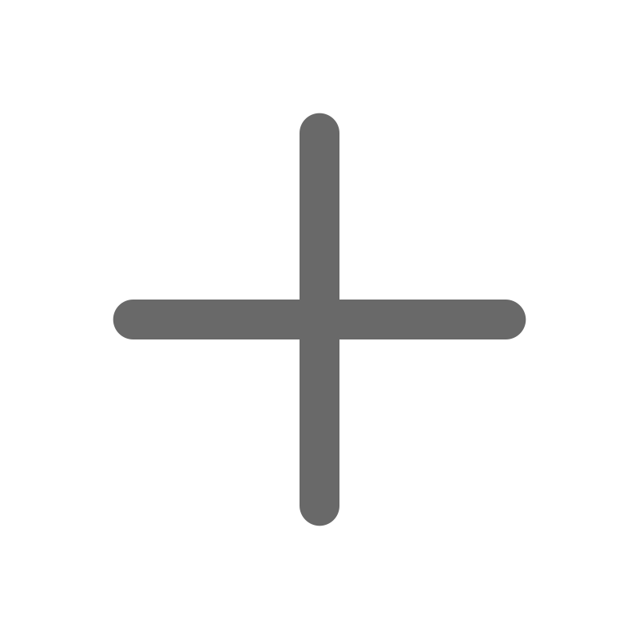
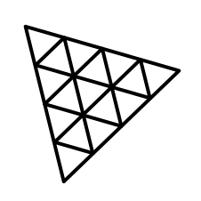

    
    
    
    
    

The objective of this project is to integrate the technology stack of vite + svelte with threejs. By doing so, you can experience a 3D representation of the planets in our solar system and read interesting information about each planet you're viewing. 🚀

[VIEW DEMO HERE](https://kreutzercode.github.io/astro-adventure/)

## ✨ Contributing

Feel free to contribute, any type of contribution is welcome.

### Development
* To start modifying the project, you will need to run `npm install` in the project folder.
* While modifing the project files, you can have to use `npm run dev` to apply changes.

### Production
* When your changes are ready to be used, you need to run `npm run build`.
* After that, the modified project is ready for use. Pull Requests of any kind are strongly encouraged!

## 👨🏽‍💻 Recommended IDE Setup

[VS Code](https://code.visualstudio.com/) + [Svelte](https://marketplace.visualstudio.com/items?itemName=svelte.svelte-vscode).

## ✅ Todo

* add more fun texts
* create moon for the earth
* add ring for saturn
* replace gsap with tween or the other way around
* fix gsap animation when mouse moves in from the right (planet spins fast)